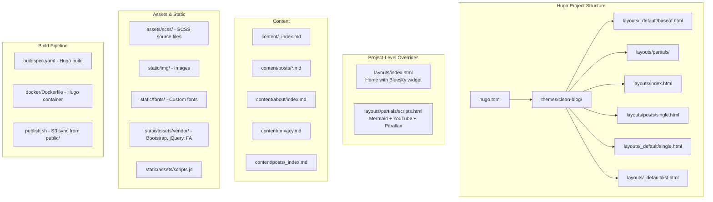

# Design Document: Jekyll to Hugo Migration

## Overview

This design describes the migration of the stormacq.com Jekyll site to Hugo. The site is a personal developer blog built with the Jekyll Clean Blog theme, Bootstrap 4, jQuery, Font Awesome, and custom SCSS. It features 11 blog posts, standalone pages (home, about, privacy, 403, 404), a paginated posts list, Open Graph metadata, Google Analytics, Mermaid diagrams, embedded YouTube videos, a Bluesky social feed widget, and parallax scroll effects. The site is built via AWS CodeBuild and deployed to S3/CloudFront.

The migration must produce a pixel-identical site with the same URL structure, preserving all content, front matter, and interactive features. A key architectural goal is theme portability: the Hugo site should use a standard theme mechanism so that switching themes requires only a config change, not content modifications.

### Key Design Decisions

1. **Theme approach**: Use a local theme directory (`themes/clean-blog/`) rather than a Hugo module, since the Clean Blog theme is vendored and customized. All layouts live inside the theme; project-level `layouts/` holds only overrides for custom features (Bluesky, Mermaid, YouTube).
2. **Config format**: `hugo.toml` (TOML) as it's Hugo's default and most common format.
3. **Content organization**: `content/posts/` for blog posts, `content/about/`, `content/privacy.md`, `content/_index.md` for standalone pages — all using standard Hugo front matter fields.
4. **Sass pipeline**: Hugo Pipes with `resources.ToCSS` to compile SCSS from `assets/`, replacing Jekyll's Sass pipeline.
5. **Static assets**: Vendor JS/CSS, images, and fonts move to `static/` to preserve existing URL paths.
6. **Permalink structure**: Configure `[permalinks]` in `hugo.toml` to match Jekyll's `/:year/:month/:day/:slug/` pattern.

## Architecture



### Directory Structure After Migration

```
├── hugo.toml
├── content/
│   ├── _index.md                    # Home page
│   ├── about/
│   │   └── index.md                 # About page (/about/)
│   ├── privacy.md                   # Privacy policy
│   └── posts/
│       ├── _index.md                # Posts list with pagination
│       ├── 2016-08-03-account-linking-lwa.md
│       ├── ...                      # All migrated posts
│       └── 2026-02-22-xcode-local-proxy-bedrock.md
├── themes/
│   └── clean-blog/
│       ├── layouts/
│       │   ├── _default/
│       │   │   ├── baseof.html      # Base template
│       │   │   ├── single.html      # Default single page
│       │   │   └── list.html        # Default list (posts pagination)
│       │   ├── posts/
│       │   │   └── single.html      # Blog post template
│       │   ├── about/
│       │   │   └── single.html      # About page template
│       │   ├── partials/
│       │   │   ├── head.html
│       │   │   ├── navbar.html
│       │   │   ├── footer.html
│       │   │   ├── scripts.html
│       │   │   └── google_analytics.html
│       │   ├── index.html           # Home page template
│       │   ├── 403.html             # Error page
│       │   └── 404.html             # Error page
│       └── theme.toml
├── layouts/                          # Project-level overrides (minimal)
│   ├── index.html                   # Override: adds Bluesky embed
│   └── partials/
│       └── extend-scripts.html      # Override: Mermaid, YouTube, parallax
├── assets/
│   ├── scss/
│   │   ├── main.scss                # Entry point
│   │   ├── styles.scss              # Custom styles
│   │   └── vendor/                  # Clean Blog SCSS
│   │       └── startbootstrap-clean-blog/scss/...
├── static/
│   ├── img/                         # All images
│   ├── fonts/                       # Custom web fonts
│   ├── assets/
│   │   ├── vendor/                  # Bootstrap, jQuery, FA, Clean Blog JS
│   │   └── scripts.js               # Custom JS
│   ├── favicon.ico
│   └── emergency.txt
├── scripts/                          # Lambda@Edge (unchanged, not part of build)
├── buildspec.yaml                    # Updated for Hugo
├── docker/
│   ├── Dockerfile                   # Hugo-based container
│   └── run-container.sh             # Updated for Hugo
└── publish.sh                        # Updated for Hugo output dir
```

## Components and Interfaces

### 1. Hugo Configuration (`hugo.toml`)

Translates all `_config.yml` settings to Hugo's TOML format.

```toml
baseURL = "https://stormacq.com"
languageCode = "en-us"
title = "Seb in the ☁️"
theme = "clean-blog"

[params]
  author = "Sébastien Stormacq"
  email = "sebastien.stormacq@gmail.com"
  description = "Developer Advocate @ AWS. This blog is about AWS Cloud, Swift & Mobile (opinions are my own)"
  twitter_username = "sebsto"
  github_username = "sebsto"
  linkedin_username = "sebastienstormacq"
  google_analytics = "UA-5360703-2"
  defaultBackground = "/img/bg-post.png"

[permalinks]
  [permalinks.page]
    posts = "/:year/:month/:day/:slug/"

[pagination]
  pagerSize = 5

[outputs]
  home = ["HTML", "RSS"]

[outputFormats.RSS]
  mediaType = "application/rss+xml"
  baseName = "feed"        # Produces feed.xml instead of index.xml

[markup]
  [markup.highlight]
    noClasses = true
    style = "monokai"
  [markup.goldmark]
    [markup.goldmark.renderer]
      unsafe = true        # Allow raw HTML in markdown

[build]
  [build.buildStats]
    disableClasses = false

# Exclude files from processing (mirrors Jekyll exclude list)
[module]
  [[module.mounts]]
    source = "content"
    target = "content"
  [[module.mounts]]
    source = "static"
    target = "static"
  [[module.mounts]]
    source = "assets"
    target = "assets"

ignoreFiles = ["buildspec\\.yaml", "publish\\.sh", "docker/.*", "scripts/.*"]
```

### 2. Base Template (`themes/clean-blog/layouts/_default/baseof.html`)

Direct equivalent of Jekyll's `_layouts/default.html`:

```html
<!DOCTYPE html>
<html>
  {{ partial "head.html" . }}
  <body>
    {{ partial "navbar.html" . }}
    {{ block "main" . }}{{ end }}
    {{ partial "footer.html" . }}
    {{ partial "scripts.html" . }}
  </body>
</html>
```

### 3. Partial Templates

#### `head.html` — Preserves Open Graph, SEO, CSS references

Key Liquid-to-Go template conversions:
- `{{ site.title }}` → `{{ .Site.Title }}`
- `{{ page.title }}` → `{{ .Title }}`
- `{{ page.description }}` → `{{ .Params.description }}`
- `{{ page.date | date_to_xmlschema }}` → `{{ .Date.Format "2006-01-02T15:04:05Z07:00" }}`
- `{{ page.excerpt | strip_html | truncatewords: 15 }}` → `{{ .Summary | plainify | truncate 160 }}`
- `{{ "/feed.xml" | relative_url }}` → `{{ "feed.xml" | relURL }}`
- `{{ page.url | absolute_url }}` → `{{ .Permalink }}`

The SCSS compilation uses Hugo Pipes:
```html
{{ $scss := resources.Get "scss/main.scss" }}
{{ $css := $scss | toCSS }}
<link rel="stylesheet" href="{{ $css.Permalink }}">
```

#### `navbar.html` — Navigation with external podcast link

Preserves the exact nav structure: AWS Console brand link, Home, About me, Le podcast AWS en 🇫🇷 (external link to `francais.podcast.go-aws.com`), Posts, My Old Blog. The podcast external link is hardcoded, not driven by a collection.

#### `footer.html` — Social icons and copyright

Conditional social links driven by `.Site.Params`:
- `` → `{{ with .Site.Params.twitter_username }}`

#### `scripts.html` — JS includes and interactive features

Includes jQuery, Bootstrap bundle, Clean Blog JS, custom `scripts.js`, video wrapper CSS, YouTube URL-to-embed JS, parallax scroll handler, Mermaid module import, and conditional Google Analytics.

The theme's `scripts.html` provides the base JS includes. The project-level override `layouts/partials/extend-scripts.html` adds Mermaid, YouTube conversion, and parallax — keeping custom JS isolated from the theme.

#### `google_analytics.html` — gtag.js snippet

Uses `{{ .Site.Params.google_analytics }}` for the tracking ID.

### 4. Page Templates

| Jekyll Layout | Hugo Template | Location |
|---|---|---|
| `home.html` | `index.html` | `themes/clean-blog/layouts/index.html` (base), `layouts/index.html` (override with Bluesky) |
| `post.html` | `posts/single.html` | `themes/clean-blog/layouts/posts/single.html` |
| `page.html` | `_default/single.html` | `themes/clean-blog/layouts/_default/single.html` |
| `about.html` | `about/single.html` | `themes/clean-blog/layouts/about/single.html` |
| `podcast.html` | *(deleted)* | Not created — podcast content already migrated elsewhere |

### 5. Home Page Template

The home page template displays:
- Masthead with background image and site title/description
- Latest 5 posts with title, subtitle/excerpt, author, date
- "View All Posts" link
- Bluesky embed widget (in the project-level override)

Key conversion: `` → `{{ range (first 5 (where .Site.RegularPages "Section" "posts")) }}`

### 6. Posts List Template with Pagination

Hugo's built-in pagination replaces `jekyll-paginate-v2`. The `content/posts/_index.md` enables pagination for the posts section. The list template uses:

```html
{{ $paginator := .Paginate .Pages }}
{{ range $paginator.Pages }}
  <!-- post preview -->
{{ end }}
```

The "Older posts migrated from Wordpress" link appears on the last page:
```html
{{ if not $paginator.HasNext }}
  <!-- Wordpress migration link -->
{{ end }}
```

Pager buttons use `$paginator.Prev` and `$paginator.Next`.

### 7. Blog Post Single Template

Preserves: masthead with background image, post title, date, content, previous/next navigation.

Key conversions:
- `{{ page.previous.url }}` → `{{ with .PrevInSection }}`
- `{{ page.next.url }}` → `{{ with .NextInSection }}`
- Background image: `{{ with .Params.background }}`

### 8. Content Migration

#### Blog Posts (`_posts/` → `content/posts/`)

File rename: `YYYY-MM-DD-slug.markdown` → `YYYY-MM-DD-slug.md` (Hugo accepts both, but `.md` is conventional).

Front matter mapping:
| Jekyll Field | Hugo Field | Notes |
|---|---|---|
| `layout: post` | *(removed)* | Hugo's lookup order handles this |
| `title` | `title` | Unchanged |
| `subtitle` | `subtitle` | Custom param, accessed via `.Params.subtitle` |
| `description` | `description` | Standard Hugo field |
| `date` | `date` | Unchanged |
| `tags` | `tags` | Unchanged (Hugo taxonomy) |
| `author` | `author` | Custom param |
| `background` | `images` + `background` | `images` for OG, `background` for masthead |
| `published: false` | `draft: true` | Hugo equivalent |

Content transformations:
- `...` → fenced code blocks (`` ```lang ... ``` ``)
- `{:target="_blank"}` (Kramdown) → `{target="_blank"}` or convert to raw HTML `<a href="..." target="_blank">`
- Mermaid code blocks: No change needed — the JS in `scripts.html` already handles `code.language-mermaid` elements, and Hugo's Goldmark renderer produces the same class.

#### Standalone Pages

- `index.md` → `content/_index.md` (front matter: remove `layout: home`, add `type: home` or rely on lookup order)
- `about.md` → `content/about/index.md` (preserves `/about/` URL via branch bundle)
- `privacy.md` → `content/privacy.md`
- `posts/index.html` → `content/posts/_index.md` (front matter enables pagination)
- `403.html` → `themes/clean-blog/layouts/403.html`
- `404.html` → `themes/clean-blog/layouts/404.html`
- `emergency.txt` → `static/emergency.txt`

### 9. Sass/CSS Pipeline

Jekyll's Sass pipeline:
```
assets/main.scss (with front matter) 
  → @import "styles" (from _sass/styles.scss)
    → @import "../assets/vendor/startbootstrap-clean-blog/scss/clean-blog.scss"
```

Hugo Pipes equivalent:
```
assets/scss/main.scss
  → @import "styles"
    → @import "vendor/startbootstrap-clean-blog/scss/clean-blog"
```

The SCSS files move to `assets/scss/` (Hugo's asset pipeline root). The `@import` paths are adjusted to be relative within `assets/scss/`. Hugo Pipes compiles via `resources.ToCSS`.

The compiled CSS is referenced in `head.html`:
```html
{{ $scss := resources.Get "scss/main.scss" }}
{{ $css := $scss | toCSS (dict "transpiler" "dartsass" "targetPath" "assets/main.css") }}
<link rel="stylesheet" href="{{ $css.RelPermalink }}">
```

Note: Hugo's built-in LibSass or Dart Sass transpiler handles SCSS compilation. The `dartsass` transpiler is preferred for full Sass compatibility.

### 10. Static Assets Migration

| Source | Destination | Rationale |
|---|---|---|
| `img/` | `static/img/` | Preserves `/img/...` URLs |
| `fonts/` | `static/fonts/` | Preserves `/fonts/...` URLs |
| `assets/vendor/` | `static/assets/vendor/` | Preserves `/assets/vendor/...` URLs |
| `assets/scripts.js` | `static/assets/scripts.js` | Preserves `/assets/scripts.js` URL |
| `favicon.ico` | `static/favicon.ico` | Preserves `/favicon.ico` URL |
| `emergency.txt` | `static/emergency.txt` | Copied as-is to output |

### 11. RSS Feed

Hugo generates RSS natively. Configuration in `hugo.toml`:
- `[outputFormats.RSS]` with `baseName = "feed"` produces `/feed.xml`
- A custom RSS template may be needed in the theme to include full content (Hugo defaults to summary)

Custom RSS template at `themes/clean-blog/layouts/_default/rss.xml` based on Hugo's embedded template, modified to include `.Content` instead of `.Summary`.

### 12. Build Pipeline

#### `buildspec.yaml`

```yaml
version: 0.2
phases:
  install:
    commands:
      - wget -qO- https://github.com/gohugoio/hugo/releases/download/v0.147.6/hugo_extended_0.147.6_linux-amd64.tar.gz | tar xz -C /usr/local/bin
      - hugo version
  build:
    commands:
      - echo Build started on $(date)
      - hugo --minify
  post_build:
    commands:
      - echo Build completed on $(date)
artifacts:
  type: zip
  files:
    - '**/*'
  name: sebinthecloud-$(date +%Y%m%d%H%M%S).zip
  base-directory: 'public'
cache:
  paths:
    - 'resources/**/*'
```

#### `docker/Dockerfile`

```dockerfile
FROM hugomods/hugo:exts

WORKDIR /src
EXPOSE 1313

CMD ["hugo", "server", "--bind", "0.0.0.0", "-p", "1313"]
```

Uses the `hugomods/hugo:exts` base image which includes Hugo Extended with Dart Sass support.

#### `docker/run-container.sh`

Uses Apple's `container` CLI (not Docker) to mount the project and run `hugo server` with live reload on port 1313:

```bash
container run -p 1313:1313 --rm --volume="$PWD:/src" -it hugo-site hugo server --bind 0.0.0.0 -p 1313 --watch --poll 700ms
```

#### Local Development Workflow

All Hugo commands are executed inside the container — Hugo is never installed locally.

- Build the container image: `container build -t hugo-site -f docker/Dockerfile .`
- One-off site build: `container run --rm --volume="$PWD:/src" hugo-site hugo --minify`
- Development server: `./docker/run-container.sh` (runs `hugo server` with live reload on port 1313)

#### `publish.sh`

Updated to sync `public/` instead of `_site/` to S3.

### 13. Jekyll Artifact Cleanup

Files/directories to remove after migration is validated:
- `Gemfile`, `Gemfile.lock`
- `_config.yml`
- `_site/`, `.jekyll-cache/`
- `_layouts/`, `_includes/`, `_posts/`, `_sass/`
- `_podcasts/`

`.gitignore` updated to replace Jekyll entries with Hugo entries:
```
public/
resources/
.hugo_build.lock
```

### 14. URL Compatibility

The permalink configuration `/:year/:month/:day/:slug/` ensures blog post URLs match exactly. Hugo generates `index.html` inside each directory, producing clean URLs identical to Jekyll's output.

Standalone page URLs are preserved through content organization:
- `/about/` via `content/about/index.md` (branch bundle)
- `/privacy.html` via `content/privacy.md` with `url: /privacy.html` in front matter
- `/posts/`, `/posts/2/`, `/posts/3/` via Hugo's built-in pagination

The Lambda@Edge scripts remain unchanged since the URL structure is identical.

### 15. Content Feature Parity

| Feature | Jekyll Implementation | Hugo Implementation |
|---|---|---|
| Mermaid diagrams | JS in `scripts.html` converts `code.language-mermaid` to Mermaid divs | Same JS, same behavior — Goldmark produces identical class names |
| YouTube embeds | JS function `yt_url2embed()` in `scripts.html` | Same JS function, carried over unchanged |
| Bluesky feed | `bsky-embed` web component in `home.html` | Same web component in project-level `layouts/index.html` override |
| Parallax scroll | jQuery scroll handler in `scripts.html` | Same jQuery handler, carried over unchanged |
| Syntax highlighting | `` Liquid tags | Fenced code blocks (`` ```lang ``) — Hugo's Chroma highlighter or same visual via existing CSS |
| Kramdown attributes | `{:target="_blank"}` | Converted to HTML `<a>` tags or Hugo render hooks |

### 16. Theme Portability

The architecture ensures theme switching by:
1. All theme layouts live in `themes/clean-blog/` — changing `theme` in `hugo.toml` swaps the entire visual layer
2. Content files use only standard Hugo front matter (`title`, `date`, `description`, `tags`, `draft`, `images`)
3. Custom params (`subtitle`, `background`, `author`) are accessed via `.Params` and gracefully ignored by other themes
4. Project-level overrides are limited to `layouts/index.html` (Bluesky widget) and `layouts/partials/extend-scripts.html` (Mermaid/YouTube/parallax)
5. Custom JS/CSS lives in `static/` and `assets/`, not inlined in templates
6. A README documents each project-level override and why it exists


## Data Models

### Front Matter Schema (Blog Posts)

```yaml
title: "string"           # Required. Post title.
date: "YYYY-MM-DDTHH:MM:SS+TZ"  # Required. Publication date.
description: "string"     # Optional. Used for OG and meta description.
tags: ["string"]          # Optional. Hugo taxonomy.
draft: true/false         # Optional. Replaces Jekyll's `published: false`.
images: ["/img/..."]      # Optional. Used for OG image. Standard Hugo field.
# Custom params (accessed via .Params):
subtitle: "string"        # Optional. Displayed below title.
author: "string"          # Optional. Defaults to site author.
background: "/img/..."    # Optional. Masthead background image.
```

### Front Matter Schema (Standalone Pages)

```yaml
title: "string"           # Required.
description: "string"     # Optional.
images: ["/img/..."]      # Optional. OG image.
# Custom params:
background: "/img/..."    # Optional. Masthead background.
```

### Site Configuration Schema (`hugo.toml` params)

```toml
[params]
  author = "string"
  email = "string"
  description = "string"
  twitter_username = "string"
  github_username = "string"
  linkedin_username = "string"
  google_analytics = "string"
  defaultBackground = "string"
```

## Correctness Properties

*A property is a characteristic or behavior that should hold true across all valid executions of a system — essentially, a formal statement about what the system should do. Properties serve as the bridge between human-readable specifications and machine-verifiable correctness guarantees.*

### Property 1: Template Liquid-Free

*For any* Hugo template file (in `themes/clean-blog/layouts/` or `layouts/`), the file shall contain zero Liquid template syntax — no `` tags, no `{{ site.* }}` or `{{ page.* }}` Liquid variable references, and no Liquid filters (e.g., `| prepend:`, `| relative_url`, `| date:`).

**Validates: Requirements 3.3, 3.8, 3.9, 3.10**

### Property 2: Content Jekyll-Syntax-Free

*For any* migrated content file in `content/`, the file shall contain no Jekyll-specific syntax — no `...` blocks, no `{:target="_blank"}` Kramdown attribute syntax, and no Liquid template tags.

**Validates: Requirements 6.3, 6.4, 15.5**

### Property 3: Blog Post URL Pattern Preservation

*For any* blog post with a given date (year, month, day) and slug, Hugo shall generate the post URL matching the pattern `/:year/:month/:day/:slug/`, identical to the Jekyll URL structure.

**Validates: Requirements 2.2, 6.6**

### Property 4: URL Parity Across All Content

*For any* page or post that exists in the Jekyll source site, the Hugo site shall produce an output file at the same URL path, ensuring no broken links after migration.

**Validates: Requirements 2.5, 14.1**

### Property 5: Static Asset Migration Completeness

*For any* file in the original `img/`, `fonts/`, or `assets/vendor/` directories, a byte-identical copy shall exist in the corresponding `static/` subdirectory (`static/img/`, `static/fonts/`, `static/assets/vendor/`).

**Validates: Requirements 10.1, 10.2, 10.3**

### Property 6: Blog Post Migration Completeness

*For any* blog post file in `_posts/`, a corresponding file shall exist in `content/posts/` with all original front matter fields preserved (with appropriate field name mappings: `published: false` → `draft: true`, `layout` removed) and all original Markdown content preserved.

**Validates: Requirements 6.1, 6.2**

### Property 7: Configuration Metadata Completeness

*For any* site metadata field defined in `_config.yml` (title, author, email, description, baseURL, social usernames, Google Analytics ID), the equivalent value shall be present in `hugo.toml` under the appropriate key or `[params]` section.

**Validates: Requirements 2.1**

### Property 8: Open Graph Tag Correctness

*For any* page with a combination of title, description, date, background image, and tags, the rendered HTML `<head>` shall contain the correct Open Graph meta tags (`og:title`, `og:type`, `og:description`, `og:url`, `og:image`, `article:published_time`, `article:author`, `article:section`, `article:tag`), and the meta description shall be at most 160 characters, falling back to the site description when no page excerpt is available.

**Validates: Requirements 4.2, 4.3**

### Property 9: Footer Social Links Conditional Rendering

*For any* combination of social media usernames (twitter, facebook, github, linkedin) present or absent in the site configuration, the footer partial shall render exactly the corresponding social media icon links — no more, no less.

**Validates: Requirements 5.2**

### Property 10: RSS Feed Content Completeness

*For any* published blog post, the RSS feed at `/feed.xml` shall contain an entry with the post's title, description, date, author, and full content body.

**Validates: Requirements 11.2**

### Property 11: Mermaid Code Block Rendering

*For any* blog post containing a fenced code block with language `mermaid`, the rendered HTML output shall include the Mermaid JS module import and the JavaScript that converts `code.language-mermaid` elements to Mermaid-renderable divs.

**Validates: Requirements 15.1**

### Property 12: Content Theme-Agnosticism

*For any* content file in `content/`, the file shall use only standard Hugo front matter fields (`title`, `date`, `description`, `tags`, `draft`, `images`) plus generic custom params (`subtitle`, `author`, `background`), and shall contain no shortcode references, partial calls, or theme-specific template logic in the body.

**Validates: Requirements 16.3, 16.6**

### Property 13: Draft and Future Post Visibility

*For any* post with `draft: true`, it shall not appear in the default Hugo build output. *For any* post with a future date, it shall not appear in the default build output. Both shall appear only when the corresponding build flags (`--buildDrafts`, `--buildFuture`) are used.

**Validates: Requirements 6.5**

## Error Handling

### Build Errors

- **Missing SCSS imports**: If the SCSS import chain is broken (e.g., missing vendor files), Hugo Pipes will fail at build time with a clear error message pointing to the missing file. The build pipeline should treat any Hugo build error as a fatal failure.
- **Invalid front matter**: Hugo will report YAML parsing errors for malformed front matter. All migrated content files should be validated before committing.
- **Missing partials**: If a template references a partial that doesn't exist, Hugo will fail at build time. The theme structure must be complete before building.

### Content Migration Errors

- **Unconverted Liquid syntax**: Any remaining `` or `{{ }}` Liquid tags in content files will be rendered as literal text by Hugo (not executed). This is a silent failure — the content will look wrong but won't cause a build error. Property 2 catches this.
- **Unconverted Kramdown attributes**: `{:target="_blank"}` will be rendered as literal text. Property 2 catches this.
- **Missing images**: If a post references an image that wasn't migrated to `static/img/`, the image will 404. Property 5 ensures all images are migrated.

### Runtime Errors

- **RSS feed URL mismatch**: If the RSS feed is generated at `/index.xml` instead of `/feed.xml`, existing subscribers will lose their feed. The `[outputFormats.RSS]` config with `baseName = "feed"` prevents this.
- **Pagination URL mismatch**: Hugo's default pagination URLs differ from Jekyll's. The pagination config must produce `/posts/`, `/posts/2/`, etc. to match.
- **404 handling**: The 404.html template must be at the correct location for CloudFront to serve it.

### Rollback Strategy

The migration branch (`hugo-migration`) provides a clean rollback path. If the Hugo site fails validation, the main branch remains untouched with the working Jekyll site.

## Testing Strategy

### Dual Testing Approach

Testing uses both unit tests (specific examples and edge cases) and property-based tests (universal properties across generated inputs). Both are complementary:
- Unit tests verify specific known scenarios and edge cases
- Property tests verify universal invariants across many random inputs

### Property-Based Testing

**Library**: [fast-check](https://github.com/dubzzz/fast-check) (JavaScript) for property-based testing of the migration scripts and output validation.

**Configuration**:
- Minimum 100 iterations per property test
- Each test tagged with: `Feature: jekyll-to-hugo-migration, Property {number}: {property_text}`

**Properties to implement**:

1. **Template Liquid-Free** (Property 1): Generate template file paths, read each file, assert no Liquid syntax patterns match.
2. **Content Jekyll-Syntax-Free** (Property 2): For each content file, assert no Jekyll-specific syntax remains.
3. **Blog Post URL Pattern** (Property 3): Generate random dates and slugs, verify Hugo produces the correct URL pattern.
4. **URL Parity** (Property 4): For each source site URL, verify the Hugo output contains a file at the same path.
5. **Static Asset Completeness** (Property 5): For each file in source asset directories, verify it exists in the target static directory.
6. **Post Migration Completeness** (Property 6): For each source post, verify the migrated file preserves front matter and content.
7. **Config Metadata Completeness** (Property 7): For each config field in _config.yml, verify it exists in hugo.toml.
8. **Open Graph Correctness** (Property 8): Generate pages with various metadata combinations, verify OG tags are correct.
9. **Footer Social Links** (Property 9): Generate config combinations with/without social usernames, verify footer renders correctly.
10. **RSS Feed Completeness** (Property 10): For each published post, verify its RSS entry contains all required fields.
11. **Mermaid Rendering** (Property 11): For posts with mermaid blocks, verify the output includes Mermaid initialization.
12. **Content Theme-Agnosticism** (Property 12): For each content file, verify no theme-specific syntax.
13. **Draft/Future Visibility** (Property 13): Generate posts with draft/future flags, verify visibility behavior.

### Unit Tests

Unit tests cover specific examples and edge cases not suited for property testing:

- **Branch creation** (Req 1): Verify `hugo-migration` branch exists and main is unchanged
- **Config values** (Req 2.3, 2.4): Verify pagination = 5, verify exclude list matches
- **Template structure** (Req 3.1, 3.4-3.7): Verify each template file exists with required structural elements
- **Navbar structure** (Req 5.1): Verify nav items, external podcast link preserved
- **Podcast cleanup** (Req 7.1-7.3): Verify _podcasts/ deleted, no podcast template exists
- **Standalone pages** (Req 8.1-8.6): Verify each page migrated to correct location
- **SCSS pipeline** (Req 9.1-9.5): Verify SCSS compiles, import chain intact, font reference preserved
- **RSS feed URL** (Req 11.1, 11.3): Verify feed.xml exists, channel metadata correct
- **Build pipeline** (Req 12.1-12.3, 12.5): Verify buildspec.yaml, Dockerfile, publish.sh updated
- **Jekyll cleanup** (Req 13.1-13.5): Verify all Jekyll artifacts removed, .gitignore updated
- **Pagination URLs** (Req 14.3): Verify /posts/, /posts/2/ exist
- **Feature parity** (Req 15.2-15.4): Verify YouTube JS, Bluesky widget, parallax JS present
- **Theme mechanism** (Req 16.1, 16.2, 16.4, 16.8): Verify theme config, minimal overrides, README exists

### Validation Script

A shell script that builds both the Jekyll and Hugo sites and compares:
1. Directory listing of output files (URL parity)
2. HTML diff of key pages (visual parity)
3. RSS feed structure comparison

This serves as the final integration test before merging the migration branch.
